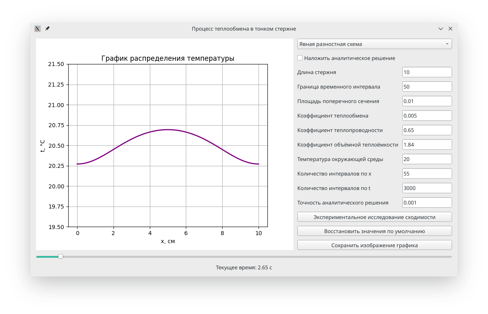

# Heat exchange process
A simple Python application that performs a heat exchange process.



# Installation
**Debian based**
```bash
sudo apt-get install git python3.6 python3-pip python3.6-tk
pip3 install virtualenv
git clone https://github.com/pribavkindenis/heat-exchange-process.git
cd ./heat-exchange-process/
./install.sh
./run.sh
```
**Arch linux**
```bash
sudo packman install git python3.6 python3-pip python3.6-tk
pip3 install virtualenv
git clone https://github.com/pribavkindenis/heat-exchange-process.git
cd ./heat-exchange-process/
./install.sh
./run.sh
```
**OS X**
```bash
brew install git python3.6 python3-pip python3.6-tk
pip3 install virtualenv
git clone https://github.com/pribavkindenis/heat-exchange-process.git
cd ./heat-exchange-process/
./install.sh
./run.sh
```
